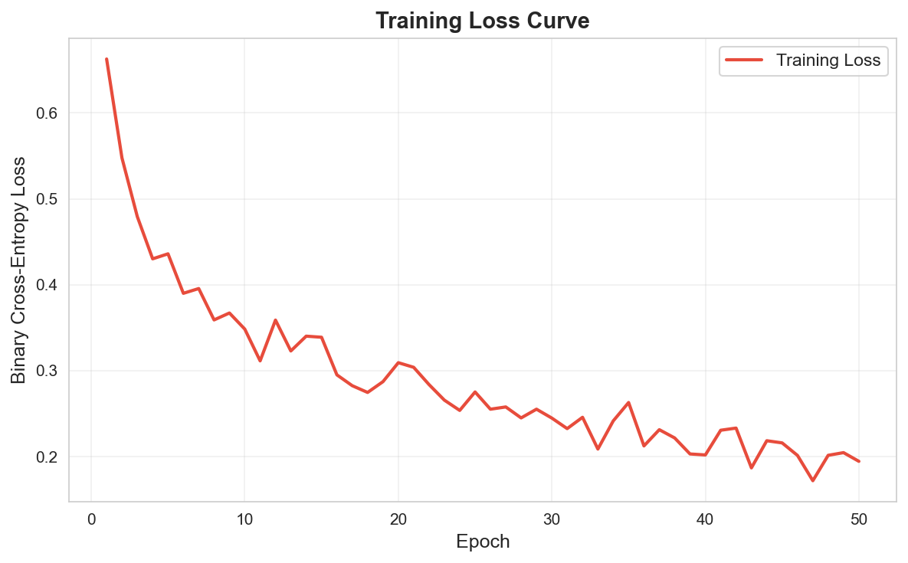

# Hybrid Deep Learning System for Early Cardiovascular Disease Risk Prediction

Author: Ajitesh Sharma

This repository contains a complete, implementable Python project for cardiovascular disease risk prediction using a deep neural network, along with notebook-based experimentation and explainability artifacts.

## System Overview

The project includes:
- A clean Python package for training, inference, and what-if simulation.
- Preserved research notebook (`main.ipynb`) for step-by-step exploratory workflow.
- Structured data, figures, and documentation folders.
- CLI scripts to run the system end-to-end.

## Repository Structure

```
Deeplearning-Cardiovascular-Detection-System/
├── data/
│   └── raw/
│       └── heart.csv
├── docs/
│   └── IDFB.md
├── models/
│   ├── heart_disease_net.pt
│   ├── scaler.joblib
│   └── metrics.json
├── notebooks/
│   └── main.ipynb                   # original Jupyter notebook (kept)
├── reports/
│   └── figures/
│       ├── class_distribution.png
│       ├── correlation_matrix.png
│       ├── feature_importance.png
│       ├── roc_curve.png
│       └── training_loss_curve.png
├── scripts/
│   ├── train.py
│   ├── predict.py
│   └── simulate.py
├── src/
│   └── cvd_risk/
│       ├── __init__.py
│       ├── config.py
│       ├── data.py
│       ├── model.py
│       ├── predict.py
│       ├── simulate.py
│       └── train.py
├── tests/
│   └── test_smoke.py
├── .gitignore
├── pyproject.toml
├── requirements.txt
└── README.md
```

## Dataset

- Source file: `data/raw/heart.csv`
- Records: 303 rows (duplicates removed at load time in code)
- Target column: `target` (0 or 1)
- Input features: 13 clinical features (`age`, `sex`, `cp`, `trestbps`, `chol`, `fbs`, `restecg`, `thalach`, `exang`, `oldpeak`, `slope`, `ca`, `thal`)

## Model Architecture

`HeartDiseaseNet` (PyTorch):
- `Linear(13 -> 128) + BatchNorm + ReLU + Dropout(0.3)`
- `Linear(128 -> 64) + BatchNorm + ReLU + Dropout(0.3)`
- `Linear(64 -> 1) + Sigmoid`

## Setup Instructions

### 1. Clone Repository

```bash
gh repo clone AJ1312/Deeplearning-Cardiovascular-Detection-System
cd Deeplearning-Cardiovascular-Detection-System
```

### 2. Create and Activate Virtual Environment

```bash
python3 -m venv .venv
source .venv/bin/activate
```

### 3. Install Dependencies

```bash
pip install --upgrade pip
pip install -r requirements.txt
pip install -e .
```

## How To Run

### Train the Model

```bash
python scripts/train.py
```

Optional custom inputs:

```bash
python scripts/train.py --data data/raw/heart.csv --epochs 75
```

Training output artifacts:
- `models/heart_disease_net.pt`
- `models/scaler.joblib`
- `models/metrics.json`

### Run Batch Prediction

Input CSV must include all 13 feature columns.

```bash
python scripts/predict.py --input data/raw/heart.csv --output predictions.csv
```

### Run What-If Risk Simulation

Example:

```bash
python scripts/simulate.py \
	--patient '{"age":63,"sex":1,"cp":3,"trestbps":145,"chol":233,"fbs":1,"restecg":0,"thalach":150,"exang":0,"oldpeak":2.3,"slope":0,"ca":0,"thal":1}' \
	--feature chol \
	--value 200
```

Output includes:
- old risk
- new risk
- percentage change

### Run Tests

```bash
pytest -q
```

## Notebook (Kept As Requested)

The notebook remains available at:
- `notebooks/main.ipynb`

The notebook workflow and the Python package implementation follow the same model and end-to-end system logic.

Use it for:
- EDA and visual analysis
- interactive training exploration
- SHAP analysis and plots

## Figures

### Class Distribution


### Correlation Matrix


### Training Loss Curve



### ROC Curve


### SHAP Feature Importance


## Development Notes

- Main package lives under `src/cvd_risk`.
- CLI layer is in `scripts/`.
- Data and reports are separated from source code for maintainability.

## Git Push Workflow

After changes are complete:

```bash
git add .
git commit -m "Restructure project into implementable Python system"
git push origin main
```

## License

Add your preferred license file (`LICENSE`) if needed.